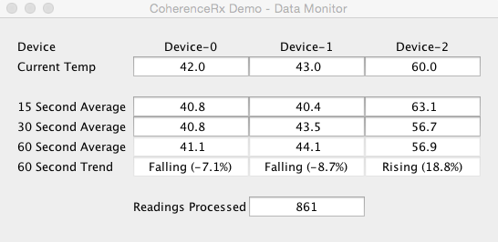

# CoherenceRx: Temperature Monitor Example

This example demonstrates how to use `ObservableMapListener` class to create
'hot' `Observables` in order to subscribe to and process asynchronous events.

```java
// create the listener
ObservableMapListener listener = ObservableMapListener.create();

// add a subscriber to print out only readings that have a temp > 50
listener.map(entry -> entry.getNewEntry().getValue())
        .filter(reading -> reading.getTemperature() > 50)
        .subscribe(System.out::println);

// Add the listener to the cache
myCache.addMapListener(listener);
```  

## Prerequisites

Ensure that the prerequisites for the building of CoherenceRx have been met, as
described in the [CoherenceRx Documentation](../../README.md).

## Build Instructions

Build the Temperature Monitor Example by running:

```
mvn clean install
```

## Running the Example

The example can be run via either:

1. IDE

   Import the `temperature-monitor` example project into your IDE and run `com.oracle.coherence.rx.examples.temp.App` class.

2. Command line   

   After building the example, run the example using:

   ```
   mvn exec:exec
   ```

## What to Expect

This example uses [Oracle Tools](https://github.com/coherence-community/oracle-tools)
to start 3 cache servers that will be used to store data.

Once the example is running, you will see two GUI windows:

- **Data Generator**

  

  Shows 3 Devices and once you click the `Start Emitting` button it will insert
  data into the cache.  You can change the temperature manually or generate
  random temperature by checking the check-box.

- **Data Monitor**

  

  Uses multiple subscribers to the event stream to display 15, 30 and 60 second
  averages, current temperatures and trends.
